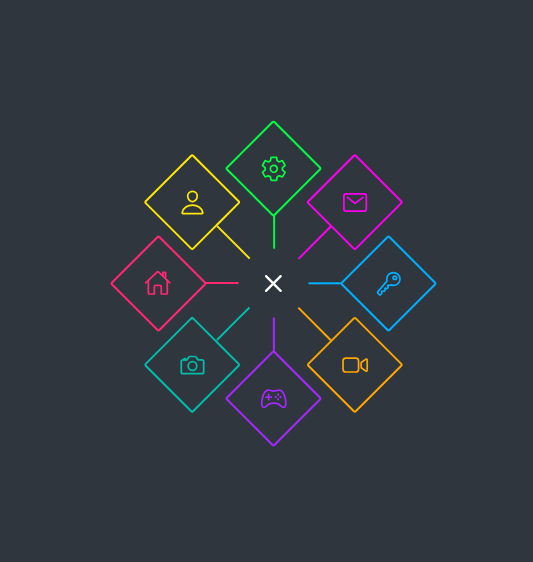

# Projeto de Estudo de Animação com CSS e JavaScript

Este projeto é uma exploração de animações criadas com CSS puro e uma pitada de JavaScript e HTML. O objetivo é aprender e experimentar diferentes técnicas de animação para tornar interfaces web mais dinâmicas e atraentes.

## Tecnologias Utilizadas

- **CSS**: Para criar transições, transformações e animações.
- **JavaScript**: Para interatividade e controle das animações.
- **HTML**: Estrutura básica da página.

## Funcionalidades

- Animações de entrada e saída de elementos.
- Efeitos de hover em botões e links.
- Transições suaves entre estados.

## Como Executar

1. Clone este repositório.
2. Abra o arquivo index.html em um navegador moderno.
3. Explore as animações e divirta-se!

## !Exemplo de Animação

Nota: A imagem acima é apenas um exemplo. 

Este projeto é apenas para fins de estudo e aprendizado.
